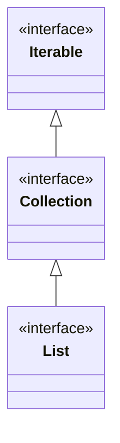

<h1 style="font-family: 'KaiTi', 'STKaiti', 'Microsoft YaHei', serif; font-style: italic; color: black; font-weight: 600;">List 简介</h1>

<span style="color: blue;">1. 什么是 List</span>

框架集合中, List是一个接口, 继承自Collection.

---




Collection也是一个接口, 规范了后续容器中常用的一些方法.

Iterable也是一个接口，表示实现该接口的类是可以逐个元素进行遍历的

---

<span style="color: blue;">2.List常见接口</span>

常用方法如下:

<table border="1" cellspacing="0" cellpadding="10">
  <thead>
    <tr>
      <th>方法</th>
      <th>解释</th>
    </tr>
  </thead>
  <tbody>
    <tr>
      <td>boolean <a href="#">add</a>(E e)</td>
      <td>尾插 e</td>
    </tr>
    <tr>
      <td>void <a href="#">add</a>(int index, E element)</td>
      <td>将 e 插入到 index 位置</td>
    </tr>
    <tr>
      <td>boolean <a href="#">addAll</a>(Collection&lt;? extends E&gt; c)</td>
      <td>尾插 c 中的元素</td>
    </tr>
    <tr>
      <td>E <a href="#">remove</a>(int index)</td>
      <td>删除 index 位置元素</td>
    </tr>
    <tr>
      <td>boolean <a href="#">remove</a>(Object o)</td>
      <td>删除遇到的第一个 o</td>
    </tr>
    <tr>
      <td>E <a href="#">get</a>(int index)</td>
      <td>获取下标 index 位置元素</td>
    </tr>
    <tr>
      <td>E <a href="#">set</a>(int index, E element)</td>
      <td>将下标 index 位置元素设置为 element</td>
    </tr>
    <tr>
      <td>void <a href="#">clear</a>()</td>
      <td>清空</td>
    </tr>
    <tr>
      <td>boolean <a href="#">contains</a>(Object o)</td>
      <td>判断 o 是否在线性表中</td>
    </tr>
    <tr>
      <td>int <a href="#">indexOf</a>(Object o)</td>
      <td>返回第一个 o 所在下标</td>
    </tr>
    <tr>
      <td>int <a href="#">lastIndexOf</a>(Object o)</td>
      <td>返回最后一个 o 的下标</td>
    </tr>
    <tr>
      <td>List&lt;E&gt; <a href="#">subList</a>(int fromIndex, int toIndex)</td>
      <td>截取部分 list</td>
    </tr>
  </tbody>
</table>
<span style="color: blue;">3.List的使用</span>

  注意：List是个接口，并不能直接用来实例化。 

```java

// 错误
List<String> list = new List<>();

// 正确
List<String> list = new ArrayList<>();
```

如果要使用，必须去实例化List的实现类。在集合框架中，ArrayList和LinkedList都实现了List接口。

```java
List<String> list = new ArrayList<>();
```